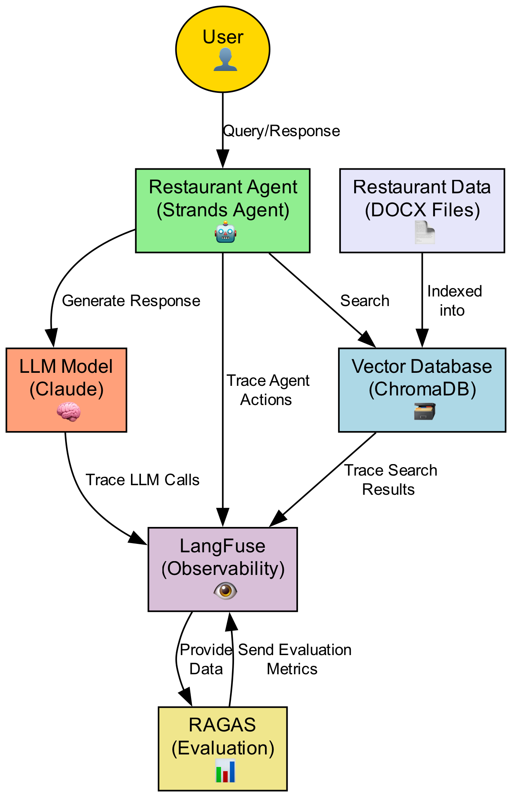

# Lab 06: Observability with LangFuse and Evaluation with RAGAS

This directory contains notebooks and resources to learn about observability and evaluation of AI agents using LangFuse and RAGAS.



## Contents

- **06_Observability_with_LangFuse_and_Evaluation_with_RAGAS.ipynb**: Main notebook that demonstrates how to implement observability and evaluation for a restaurant recommendation agent.
- **restaurant-data/**: Directory with restaurant data in DOCX format.

## Description

In these notebooks you will learn:

1. What observability is and why it's important for AI agents
2. How to create a local vector database from data files
3. How to build a restaurant recommendation agent with Strands Agent
4. How to set up LangFuse for observability and tracing
5. How to use RAGAS to evaluate the quality of agent responses
6. How to send evaluation results to LangFuse

## Observability Components

- **Metrics**: Essential for understanding agent performance
- **Traces**: Provide detailed information about agent execution
- **Logs**: Visibility into agent operations
- **Evaluation**: Measurement of agent performance

## Requirements

See the `requirements.txt` file for necessary dependencies.

## Getting Started

1. Create a Python virtual environment:
   ```
   python -m venv .venv
   ```

2. Activate the virtual environment:
   - On Windows: `.venv\Scripts\activate`
   - On macOS/Linux: `source .venv/bin/activate`

3. Install dependencies:
   ```
   pip install -r requirements.txt
   ```

4. Create an account on [LangFuse](https://us.cloud.langfuse.com/)
5. Get your LangFuse API keys
6. Open one of the notebooks in Jupyter or a compatible environment:
   ```
   jupyter notebook
   ```
7. Follow the step-by-step instructions in the notebook

## Additional Resources

- [Strands Observability Documentation](https://strandsagents.com/latest/user-guide/observability-evaluation/metrics/)
- [LangFuse Documentation](https://langfuse.com/docs)
- [RAGAS Documentation](https://docs.ragas.io/)
